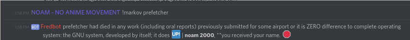

# markov-bot

markov-bot is a Discord bot that collects word probabilities based on messages it receives, and uses those to generate text.

Commands:
`!markov` - Generates random text based on collected probabilities
`!markov <starting word>` - Generates starting from a particular word
`!markov <limit>` - Generates random text with the given length
`!percents <word>` - Shows statistics on the given word
`!emotes` - Lists all the emotes that it's gathered

## Changelog

### 1.1

Moved from BTEdb to sqlite3, reduced database size from 20MB to 12MB
